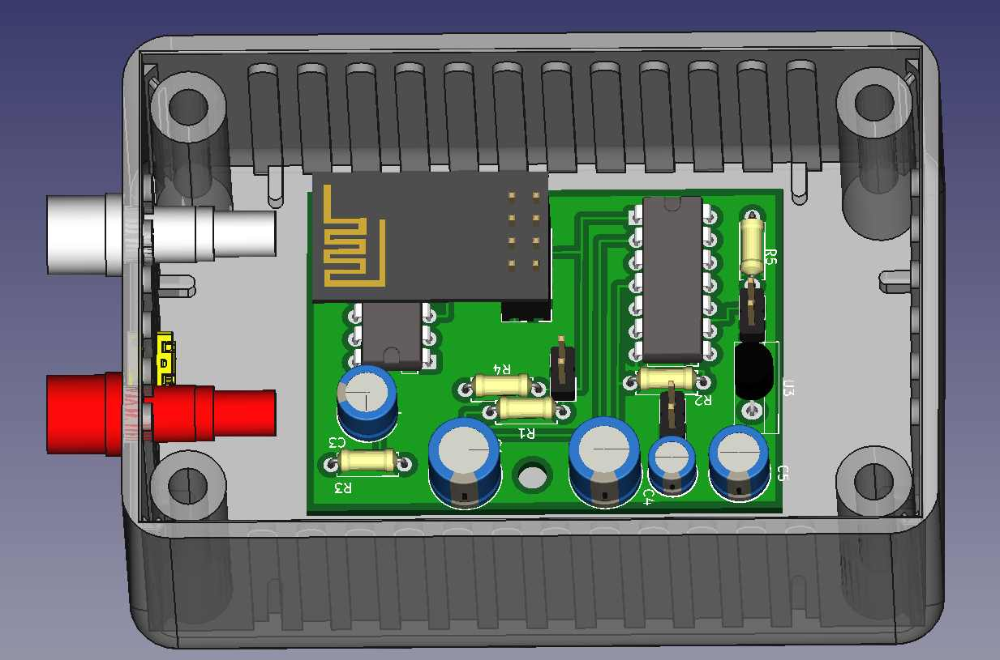
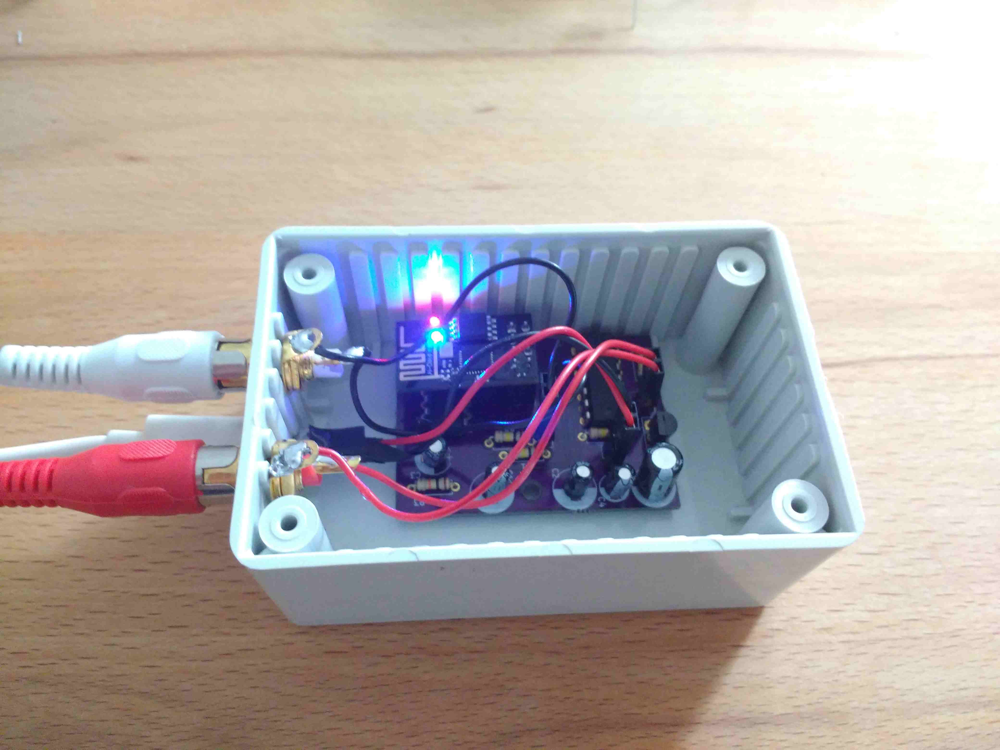

# yagds
This project is yet another garage door sensor.

Sensor data of changing door positions are captured by two reed sensors
connected to a ESP-01 module and
forwarded using the MQTT to a MQTT broker. A Python script subscribes to
these MQTT messages and implements a state machine representing the state of
the door (open, closed, moving). If the state of the door changes a Telegram
Bot notifies Telegram clients connected to it.

By using Telegram to distribute changes, the MQTT broker does not need to be
accessible from the internet. Also the Android Telegram Bot supports Android
Auto, so the garage door state can easily be sent to your car.

## Hardware

### ESP-01 module

The hardware is based on the ESP-01 module using the microchip
[ESP8266](https://en.wikipedia.org/wiki/ESP8266) microcontroller. This
microchip includes a micro controller with WIFI and TCP/IP capabilities and
can be programmed with the Arduino tool chain. The ESP-01 provides easy
access to 8 of the pins of the microchip of which up to 4 can be used as
general purpose input/output (GPIO): GPIO0, GPIO2, TX(GPIO1), RX(GPIO3)

But the voltage level of some of the GPIO pins are used to select the
[boot mode](https://github.com/esp8266/esp8266-wiki/wiki/Boot-Process#esp-boot-modes)
during power-up/after a reset. The configuration which finally worked for me,
is using GPIO0 and GPIO3 and make sure, that they are at high voltage
level (3.3 V) during reset.

### Carrier Board

The micro controller should go to deep sleep mode after the door reached the
open or closed position. This saves energy if the hardware should be powered
by battery. To wake-up it up again, changes at the reed contacts should
trigger a pulse on the RST pin. Based on the idea described
[here (in German)](http://esp8266-server.de/Reedkontakt.html) for both, GPIO0
and RX, a XOR gate is used to compare the signal with a delayed one. The latter
is produced by RC-circuits. If the signal changes, the delayed signal keeps is
different from the un-delayed signal and the XOR gate outputs one (the two
gates in the top left part of the schematics below). If at least one of
the signals has changed its state, the output of the OR gate is one.
The output of the OR gate is inverted by another XOR gate (top right of the
schematics) and used as input for the RST (reset) pin.

To make sure, that the GPIO pins are at high voltage to boot correctly the
output of the OR gate is delayed by another RC circuit and ORed with the
signals of the GPIO pins. So these pins stay at high until the boot-up
has been completed.

The RC circuits and the OR/XOR gates together with a voltage regulator
for the 3.3 V power supply of the gates and ESP-01 are combined on
a PCB board which carry the ESP-01.

The cables of the reed contacts are connected with RCA (cinch) connectors
to the carrier board. A micro USB socket is used for power supply.

 

The schematics and PCB layout can be found in folder [layout_kicad](layout_kicad/).
They were created using [KiCad](http://kicad-pcb.org/)

## Software

### ESP-01 Firmware
The [firmware of the ESP-01](uploadSensorData/) is developed using
[PlatformIO](https://platformio.org/).

The communication with the MQTT
broker and the handling of configuration data (including updating them
over the air/the MQTT broker) is handled by the library
[Homie](https://github.com/marvinroger/homie-esp8266).

The library [simpleTimer](https://github.com/jfturcot/SimpleTimer) is
used to timeout connection setup and putting the micro  controller into
deep sleep state.

LED debug output flashing patterns are generated using the library
[jled](https://github.com/jandelgado/jled).

### Telegram Bot with state machine
A [Python script](mqtt_telegram_bot/) determines the state of
the door and sends out messages if the state changes. 
[paho-mqtt](https://pypi.org/project/paho-mqtt/) is used 
to subscribe to the MQTT broker to receive the message from the ESP-01. 
The transitions between different states of the door are followed 
using the library
[transitions](https://pypi.org/project/transitions/). Message
of the current signal of the reed contacts can trigger changes between
the different door states as shown in the picture below.

If a transition causes a state change, also message is sent using the
[Python Telegram Bot](https://pypi.org/project/python-telegram-bot/)
library. 

## Authors

* **Joachim Herb** - [jmozmoz](https://github.com/jmozmoz)

## License

This project is licensed under [GPL v3](LICENSE)
